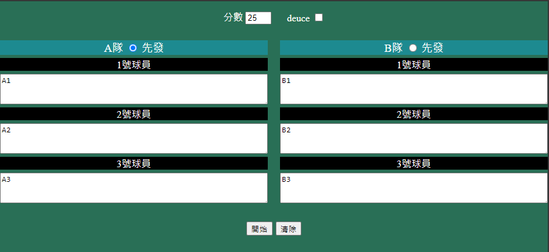
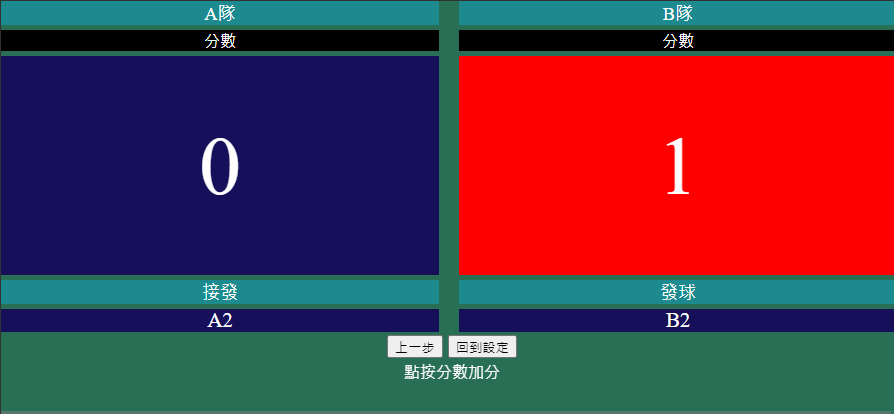

# Badminton 3v3 scoreboard

## introduction

server that return reactive pure frontend webpage, which route

- /\
    user setup player names, score and deuce rule.
    
- /scoreboard\
    keep track of scores and server
    

## run project

requirement: git, python

### git bash command

```bash
git clone 'https://github.com/AlbertDoggyLin/3v3ScoreboardServer'
pip install virtualenv
python -m virtualenv venv
source ./venv/Scripts/activate
pip install -r requirements.txt
python server.py
```
